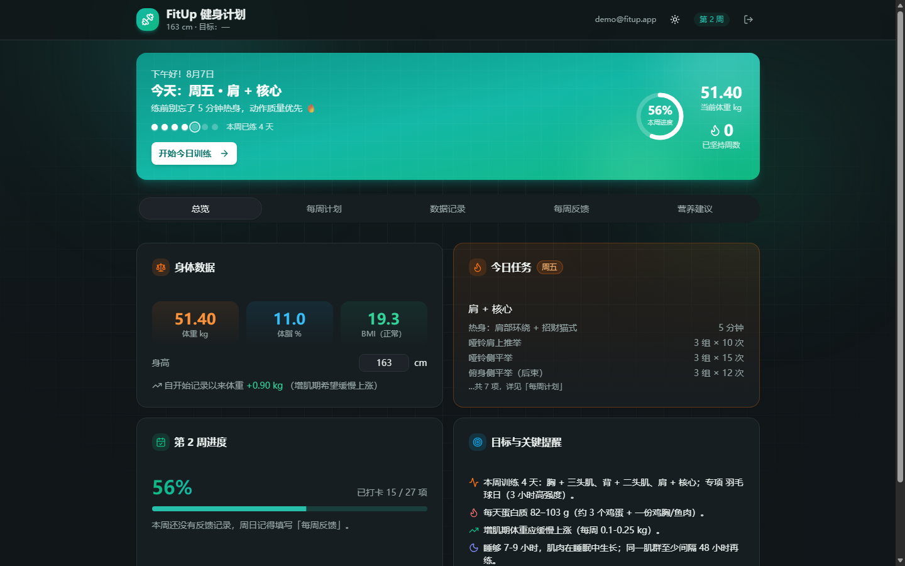
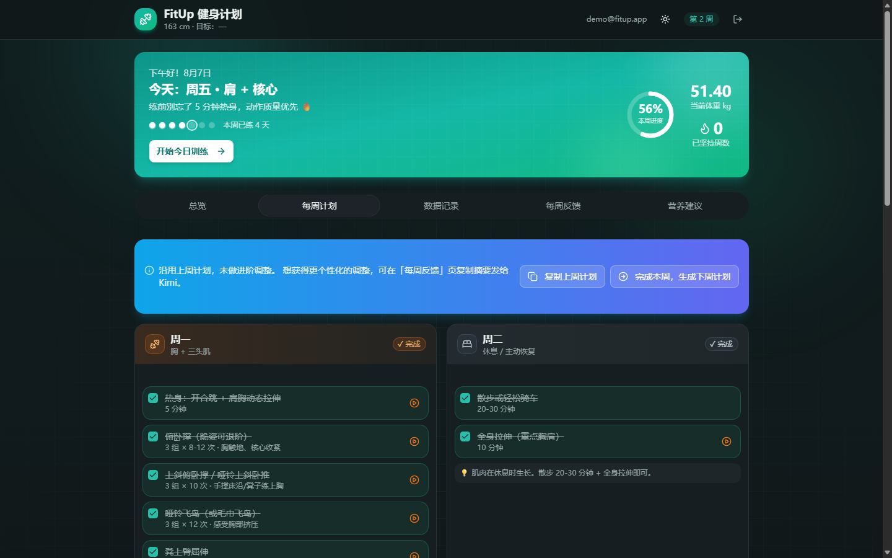
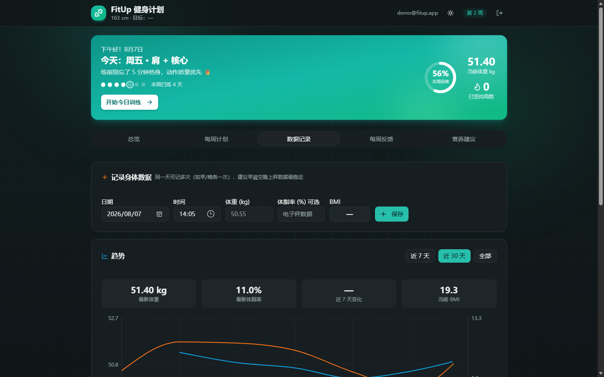
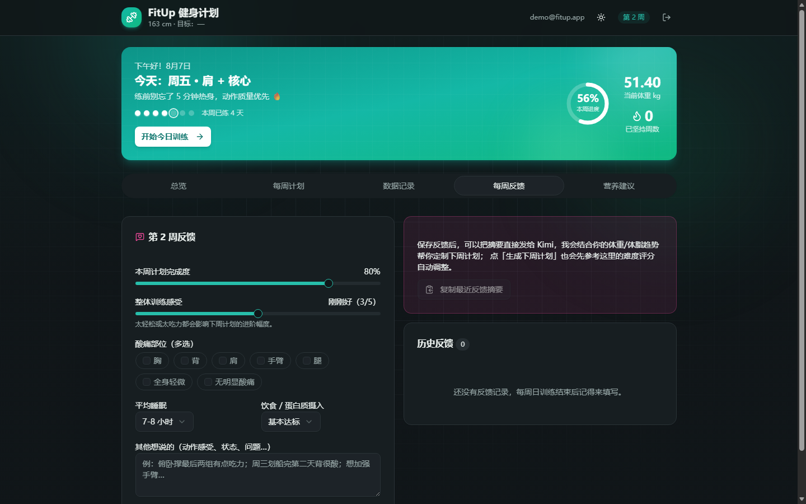
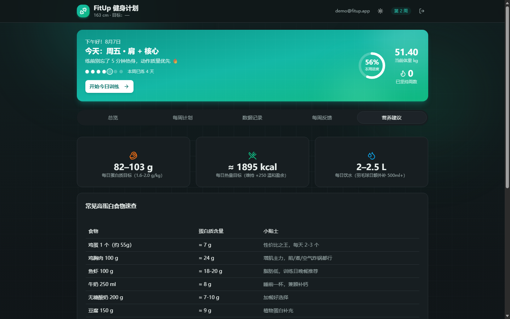
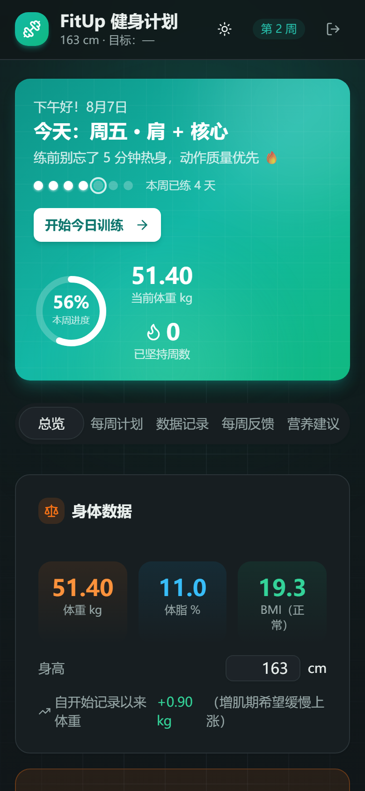
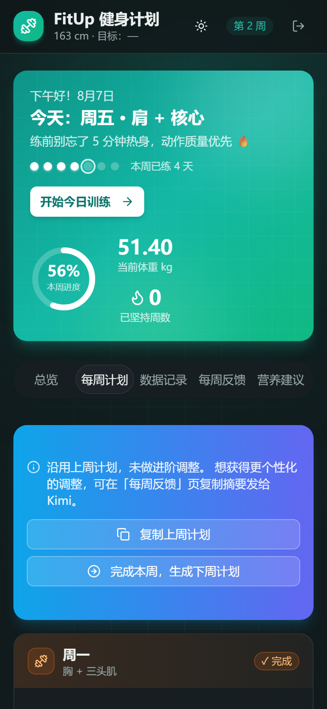
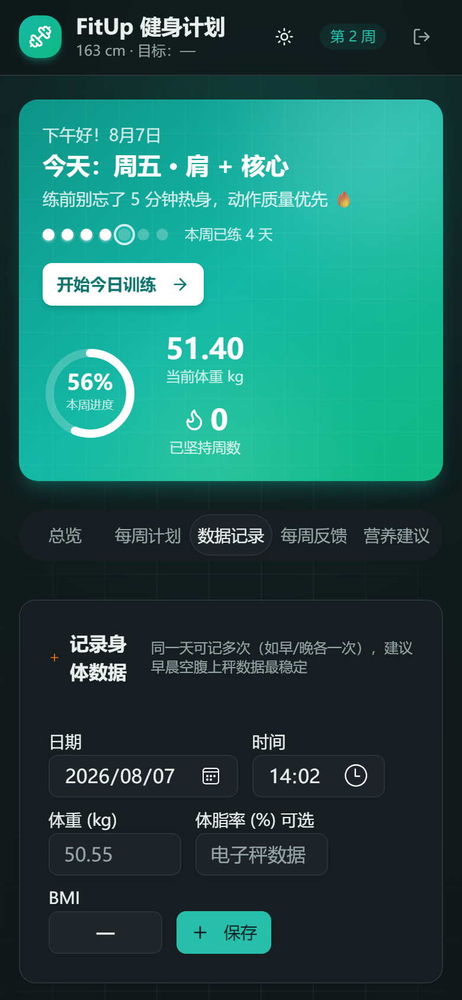
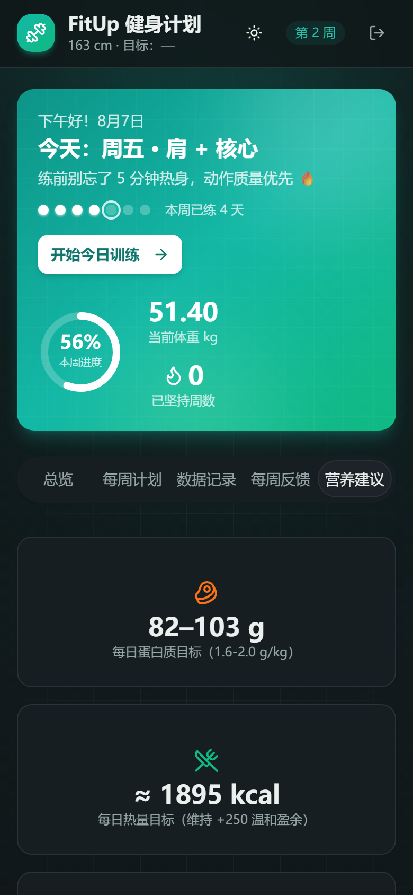

<div align="center">


# FitUp 健身计划

**你的私人 AI 健身教练 —— 个性化训练计划、每日打卡、身体数据追踪、每周反馈与营养建议**

[](LICENSE)
[](https://github.com/Craftr-X/fitnessWeb/actions/workflows/ci.yml)
[](https://react.dev)
[](https://www.typescriptlang.org)
[](https://vite.dev)
[](https://supabase.com)
[](#-常用命令)

[功能特性](#-功能特性) · [在线预览](#-应用截图) · [快速开始](#-快速开始) · [部署](#-部署) · [项目结构](#-项目结构)

</div>

---

新用户通过**邮箱验证码**免密登录后，经引导流程采集身体画像（目标、器械、频率、专项运动、伤病等），计划引擎自动生成**匹配你的一周训练计划**，并随每周反馈持续进阶调整。

<div align="center">
  
</div>

## ✨ 功能特性

- 🔐 **邮箱验证码登录** — passwordless，无需记忆密码
- 🎯 **个性化计划引擎** — 按目标（增肌/减脂/塑形/保持）、器械、训练频率、专项运动、伤病生成差异化一周计划
- 📈 **渐进超负荷** — 计划随周数自动进阶，并根据上周反馈难度动态调节
- ✅ **每日打卡** — 训练动作逐项勾选，完成动画激励
- ⚖️ **身体数据追踪** — 体重/体脂记录与趋势图
- 🔄 **每周反馈** — 完成度、难度、酸痛、睡眠、饮食，反馈驱动下周调整
- 🍗 **营养建议** — 按体重目标计算热量盈余/缺口与蛋白质摄入
- 🔒 **用户数据隔离** — Supabase RLS 行级安全，每个用户只能访问自己的数据
- ♻️ **跨周自动续期** — 进入新自然周自动生成新计划，多周未打开可一次性补齐
- 🌙 **现代前端体验** — 暗色模式、路由懒加载、移动端自适应

## 📸 应用截图

### 桌面端

<div align="center">
  
  
  
  
</div>

### 移动端

<div align="center">
  
  
  
  
</div>

## 🛠 技术栈

| 类别 | 技术 |
|---|---|
| 框架 | React 19、React Router 7 |
| 构建 | Vite 7、TypeScript 5.9 |
| 样式 | Tailwind CSS 3、shadcn/ui（Radix UI） |
| 后端 | Supabase（Auth + Postgres + RLS） |
| 表单 | React Hook Form、Zod |
| 可视化 | Recharts |
| 测试 | Vitest + Testing Library（137 个单元测试） |
| CI/CD | GitHub Actions（lint + test + build → Pages 部署） |

## 🚀 快速开始

**前置要求**：Node.js 18+，一个 [Supabase](https://supabase.com) 项目。

```bash
# 1. 克隆仓库
git clone https://github.com/Craftr-X/fitnessWeb.git
cd fitnessWeb/app

# 2. 安装依赖
npm install

# 3. 配置环境变量（填入你的 Supabase 凭据）
cp .env.example .env.local

# 4. 启动开发服务器
npm run dev   # http://localhost:3000
```

Supabase 配置（建表 + RLS + Auth）详见 [`app/README.md`](app/README.md)，建表 SQL 在 [`app/supabase/schema.sql`](app/supabase/schema.sql)。

## 📋 常用命令

```bash
cd app
npm run dev        # 开发服务器
npm run build      # 类型检查 + 生产构建
npm run test       # 单元测试（137 个）
npm run lint       # ESLint
```

## 📦 部署

推送到 `main` 分支后，GitHub Actions 自动构建并部署到 GitHub Pages。完整部署步骤（含 Supabase SMTP / OTP 邮件配置）见 [`DEPLOY.example.md`](DEPLOY.example.md)。

## 📂 项目结构

```
fitnessWeb/
├── app/                      # 前端应用
│   ├── src/
│   │   ├── lib/              # 核心逻辑（store 同步、planEngine 规则引擎、supabase）
│   │   ├── pages/            # 页面（Home、Auth、Onboarding）
│   │   ├── sections/         # 首页 tab 区块（Overview、WeeklyPlan、Nutrition 等）
│   │   ├── components/ui/    # shadcn/ui 组件
│   │   ├── hooks/            # useAuth 等
│   │   └── types/            # TypeScript 类型定义
│   ├── supabase/schema.sql   # 建表 + RLS 策略
│   └── README.md             # 开发详细文档
├── docs/                     # 工作记录与推广截图
├── .github/workflows/        # CI（lint+test+build）+ CD（Pages 部署）
└── DEPLOY.example.md         # 部署配置文档
```

## 🤝 参与贡献

欢迎提交 Issue 和 Pull Request！

1. Fork 本仓库
2. 创建特性分支：`git checkout -b feat/amazing-feature`
3. 提交改动：`git commit -m "feat: add amazing feature"`
4. 推送分支：`git push origin feat/amazing-feature`
5. 发起 Pull Request

提交前请确保 `npm run lint` 和 `npm run test` 全部通过。

## 📄 License

基于 [Apache License 2.0](LICENSE) 开源。

---

<div align="center">
  如果这个项目对你有帮助，欢迎 ⭐ Star 支持一下！
</div>
